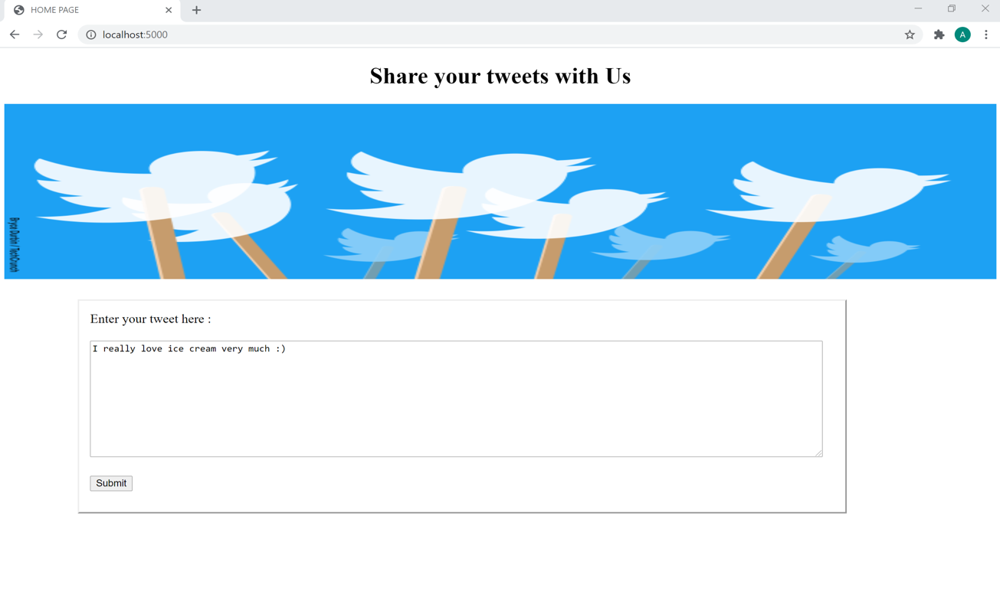
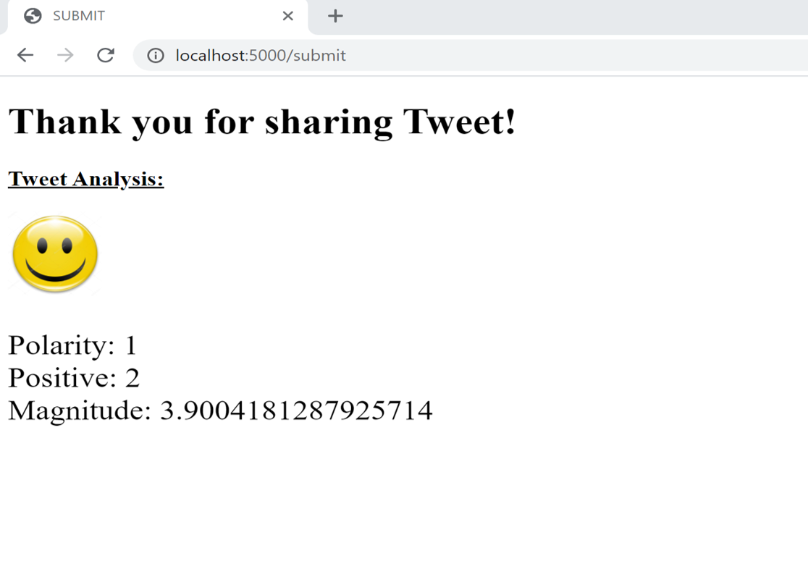
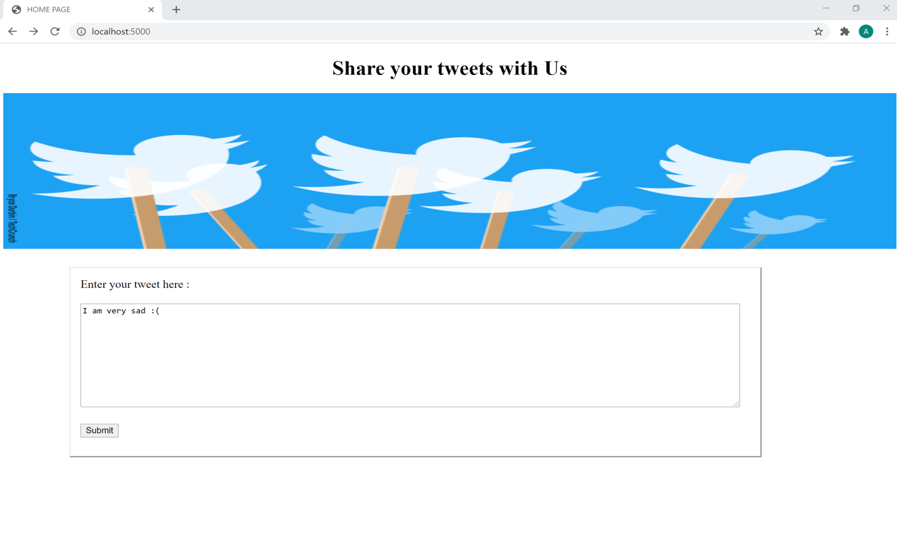
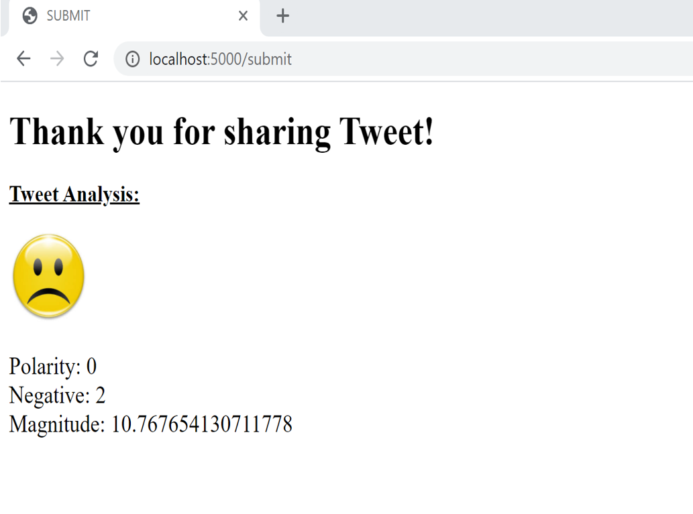

# Sentiment-Analysis-of-Tweet

This is a flask based python website to analyze the sentiment (Positive/Negative) of a tweet by a model trained using twitter dataset and Naive Bayes algorithm.
It contains 2 python files and 3 templates.
1. SentimentalAnalysis.py: This file contains our Twitter Classifier class which we will import in app.py to predict the sentiments.
2. app.py: In this file, we implemented the flask framework to get the user input tweet on our webpage and perform its analysis. 
3. Index.html: This is the homepage of our website.
4. Feedback1.html: This page will be displayed if the input tweet is positive.
5. Feedback1.html: This page will be displayed if the input tweet is negative.

# Literature Review

Natural Language Processing, or NLP for short, is broadly defined as the automatic manipulation of natural language, like speech and text, by software. 
Natural Language Processing is the driving force behind the following common applications:
- Language translation applications such as Google Translate
- Word Processors such as Microsoft Word and Grammarly that employ NLP to check grammatical accuracy of texts.
- Interactive Voice Response (IVR) applications used in call centers to respond to certain users’ requests.
- Personal assistant applications such as OK Google, Siri, Cortana, and Alexa.  

Natural Language Processing plays a critical role in supporting machine-human interactions.  

# Process
1. Importing the appropriate libraries
2. Load the training dataset
3. Preprocessing  
   When preprocessing, we perform the following:  
    - Eliminate handles and URLs
    - Tokenize the string into words.
    - Remove stop words like "and, is, a, on, etc."
    - Stemming- convert every word to its stem. Like dancer, dancing, danced, becomes 'danc'. 
    - Convert all words to lowercase.
4. Compute freq(w, class)
5. Implement Naive Bayes classifier
6. Predict the sentiment of given tweet

# Examples
## 1. For a positive tweet:  

## On clicking Submit, we get  

## 2. For a negative tweet:

## On clicking Submit, we get  

